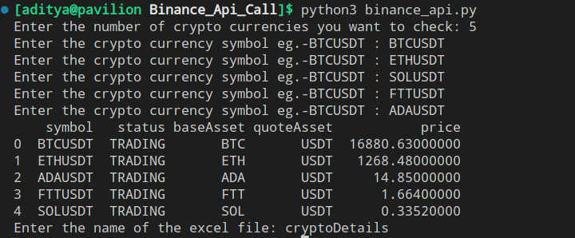

# Binance Api Call
binance api call using python and c


### Dependencies :
```pip install pandas```

### How to use

run the program using - 
```
python3 binance_api.py
```

input total no of crypto you want to get details of eg -5 


then input crypto symbols eg - BTCUSDT , ETHUDT , ADAUSDT , FTTUSDT(lol) , SOLUSDT

### Output Screenshot



